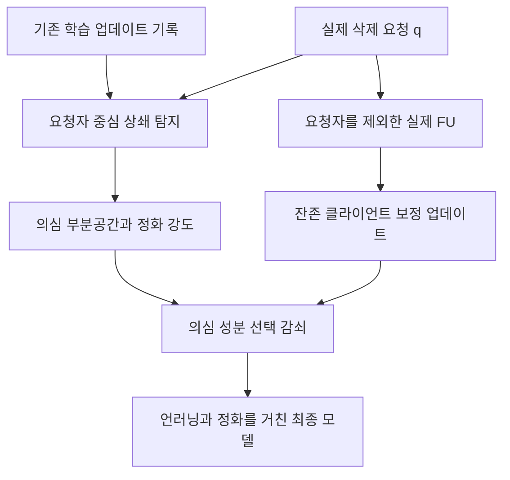

# 언러닝 이행과 백도어 정화를 결합하는 연구 계획

2026년 10월 8일 · 교수님 논의용 연구 제안

연합학습에서 위장 역할을 하는 참여자의 삭제 요청을 이행하면, 학습 중 상쇄되어 있던 백도어가 활성화될 수 있다. 본 연구는 **별도의 탐지용 언러닝 시뮬레이션 없이, 기존 업데이트 기록으로 상쇄 관계를 탐지하고 실제 언러닝 과정에서 잔존 백도어 성분을 선택적으로 정화하는 방법**을 개발한다. 삭제 요청은 탐지 결과와 관계없이 이행하며, 정상 성능과 삭제 효과를 함께 평가한다.

우선 FUBA와 BadFU 공식 코드의 클라이언트 분리형 설정에서 방법을 검증한다. 예비 실험은 탐지 신호와 방향 기반 정화의 가능성을 보여주지만, 실제 FU의 정화 성능과 낮은 오탐률은 아직 확보하지 못했다. 다음 단계의 우선순위는 탐지기를 복잡하게 만드는 것보다 **실제 FU에서 올바른 정화 방향이 주어졌을 때 효과가 있는지 확인하는 것**이다.

## 교수님께 설명할 핵심 내용

현재는 언러닝으로 활성화되는 백도어를 대상으로, 삭제 요청을 이행하면서 동시에 정화하는 방향으로 연구를 진행하려고 합니다. 공격자는 백도어를 심는 역할과 이를 학습 중 감추는 위장 역할을 분리할 수 있고, 위장 역할의 기여가 삭제되면 백도어가 드러납니다. 저는 서버에 이미 남아 있는 업데이트 기록에서 이 상쇄 관계를 찾고, 실제 언러닝 과정에서 잔존 참여자의 위험한 업데이트 성분만 줄이는 방법을 생각하고 있습니다.

핵심은 탐지를 위해 가상의 언러닝을 추가로 실행하지 않는다는 점입니다. 삭제 요청자는 이미 알려져 있으므로 그 요청자와 다른 참여자의 관계를 우선 검사하고, 탐지 신뢰도에 따라 정화 강도를 달리하려고 합니다. 탐지가 완벽하지 않더라도 정상 성능 손실을 제한하면서 ASR을 낮출 수 있는지를 확인하겠습니다.

현재 소규모 실험에서는 업데이트의 상쇄 신호와 부분공간 정화의 가능성을 관측했습니다. 다만 기여 차감으로 만든 근사 모델에서 얻은 결과가 중심이며, 실제 언러닝 결과의 대응 검증과 정상 환경의 오탐 개선이 필요합니다. 우선 실제 FU에서 정화 효과를 검증한 뒤, 탐지 오류에 따른 정화 강도와 전체 비용을 평가하고, 마지막으로 후속 FL에서 백도어가 다시 활성화되는지를 확인하려고 합니다.

## 연구 문제와 적용 범위

FUBA는 백도어를 주입하는 Adv-attacker와 이를 억제하는 Adv-defender의 역할을 나누고, Adv-defender의 언러닝 요청을 통해 백도어를 활성화한다. 이 연구는 삭제 전후에 공격의 가시성이 달라진다는 문제를 제기한다. [FUBA 논문](https://ieeexplore.ieee.org/document/11231135/)

BadFU의 arXiv v1 본문과 Algorithm 1은 단일 악성 클라이언트 내부에 백도어 데이터 D_bd와 위장 데이터 D_c를 넣고 D_c를 삭제하는 설정이다. 반면 확인한 공식 예제의 공격 활성화용 `ul` 경로는 client 0에 정상+백도어, 추가 client 5에 정상+위장을 배치하고 client 5를 제외해 FU를 수행한다. 같은 클라이언트에 둘 다 넣는 `cv` 경로의 후속 FU는 정상 client 1을 삭제한다. 따라서 분리형 설정은 공식 구현에 근거한 평가 대상이지만, 결과를 단일 클라이언트 내부의 샘플 삭제까지 일반화하지 않는다. [BadFU 본문](https://arxiv.org/html/2508.15541v1#S4.S1), [공식 구성](https://github.com/BingguangLu/BadFU/blob/0a2117feab58faf5b7e2a1e5e1759112087d6049/badfu.py#L159-L188), [공식 FU 경로](https://github.com/BingguangLu/BadFU/blob/0a2117feab58faf5b7e2a1e5e1759112087d6049/badfu.py#L505-L561)

첫 버전은 서버가 개별 업데이트와 참여 기록을 볼 수 있는 환경을 전제로 한다. 개별 업데이트를 숨기는 secure aggregation 환경과 단일 클라이언트 내부의 완전한 상쇄는 별도 확장 범위다. 정화 과정에서 위장 데이터를 남기거나 다시 학습하여 백도어를 감추는 방식을 사용하지 않는다. 삭제 대상과 일치하는 학습 정보의 제거는 FU가 담당하며, 정화는 잔존 모델의 공격 위험을 다룬다.

## 현재 확보한 근거

아래는 저장 로그에 대한 감사 결과다. 동일 프로토콜로 새로 재실행한 최종 성능표가 아니다. 상세 수치와 실행 범위는 [기존 연구 현황](RESEARCH_STATUS_2026-10-07.md)에 있다.

| 항목 | 관측한 사실 | 현재 가능한 해석 |
|---|---|---|
| 공격 관련 집합 식별 | 소규모 FUBA 공격 실행 5개에서 타깃·공격자·요청자가 정답과 일치 | 공격이 있는 제한된 설정에서 식별 신호가 존재 |
| 근사 정화 | 기여 차감 모델에서 ACC +2.06~8.39%p, ASR −12.29~26.07%p | 방향 기반 개입의 가능성. 독립 seed 5회나 실제 FU 성능으로 해석하지 않음 |
| 정상 대조군 | 정상 클라이언트 8명 중 5명을 잘못 지목 | 공격 유무 판정과 정상 분포 보정이 필요 |
| 실제 retrain FU | 저장 로그 ASR 63.70→60.20% | 개선은 제한적이며, 데이터 분할·산출물 대응 문제를 먼저 해소해야 함 |
| 효율성 | 기존 시간 측정은 축약 연산만 측정 | 실제 전체 비용과 확장성은 새로 검증해야 함 |

학습 seed와 retrain 데이터 분할의 불일치 가능성, 실행별 산출물 대응, 원 공격 트리거와 retrain 트리거 구분을 우선 정리한다. 이 조건이 해결되기 전에는 현재 수치로 방법의 최종 성공이나 실패 원인을 확정하지 않는다. [구현 충실도 감사](ATTACK_FIDELITY_AND_DIRECTION_2026-10-08.md)

## 선행연구에서 가져올 요소와 차별점

| 선행연구 | 참고할 요소 | 본 연구에서의 역할과 차이 |
|---|---|---|
| [FoolsGold](https://www.usenix.org/conference/raid2020/presentation/fung) | 클라이언트 업데이트 관계로 협력 공격을 식별 | 같은 방향의 유사성에서 삭제 요청자와 잔존자의 상쇄 관계로 초점을 옮김 |
| [FLDetector](https://arxiv.org/abs/2207.09209) | 과거 업데이트와 여러 라운드의 일관성 검사 | 반복되는 상쇄를 검사하되 L-BFGS 예측기를 그대로 도입하지는 않음 |
| [MASA](https://arxiv.org/html/2411.01040v1) | 로컬 모델별 개별 언러닝으로 악성 모델 판별 | 탐지용 언러닝 계산이 있는 비교군. 본 연구는 해당 계산을 수행하지 않음 |
| [FLAME](https://www.usenix.org/conference/usenixsecurity22/presentation/nguyen) | 클러스터링·클리핑·노이즈를 결합한 백도어 억제 | 시뮬레이션이 없는 기존 방어와도 비교하여 비용만으로 새로움을 주장하지 않음 |
| [Gradient Projection Memory](https://arxiv.org/abs/2103.09762) | 중요한 지식의 부분공간을 보존하는 업데이트 제어 | 잔존 정상 지식 보존의 설계 참고. FU 보장으로 직접 전용하지 않음 |
| [확률 보정 연구](https://proceedings.mlr.press/v70/guo17a.html) | 모델 점수와 실제 정답 확률의 구분 | raw 탐지 점수를 악성 확률이라고 부르지 않고 별도 보정·검증 |
| [Neurotoxin](https://arxiv.org/abs/2206.10341) | 정상 학습에 잘 지워지지 않는 백도어의 지속성 | 후속 FL이 자동으로 공격을 없앤다는 가정을 검증할 비교 공격 |
| [SCRUB-FL 사전공개 논문](https://arxiv.org/abs/2606.22700) | 의심 패턴 생성과 학습 후 정화 | 추가 생성기·의심 샘플 학습이 있는 인접 연구. 기존 업데이트를 쓰는 본 연구와 정보·비용 조건을 구분 |

기존 탐지와 투영을 단순히 연결하는 것만으로는 충분한 차별점이 되기 어렵다. 연구의 기여는 **삭제 요청에 조건화된 상쇄 신호가 잔존 위험을 얼마나 설명하는지**, **불완전한 추정에서도 정화와 정상 성능의 균형을 통제할 수 있는지**, **실제 FU 계산을 재사용하여 추가 탐지 학습을 없앨 수 있는지**에 둔다. 최초·범용·보장이라는 표현은 해당 근거가 확보되기 전에는 사용하지 않는다.

## 제안 알고리즘

세부 수식·입출력·예외 처리·의사코드는 [알고리즘 명세](ALGORITHM_SPEC_2026-10-08.md)에 정의한다. 첫 구현은 클래스별 분류 헤드 업데이트와 FedEraser 계열의 실제 FU 보정 경로를 대상으로 한다.

1. **기록과 요청자 중심 검사.** 동일 글로벌 모델에서 출발한 로컬 업데이트에 실제 집계 가중치를 반영한다. 요청자 q와 공동 참여한 다른 클라이언트의 클래스별 방향·상쇄 크기·반복성을 검사한다. 정상 기준보다 충분히 크지 않으면 공격자나 타깃을 억지로 선택하지 않는다.
2. **부분공간 추정.** 반복적으로 q와 상쇄한 잔존 클라이언트의 기록에서 낮은 차원의 의심 공간을 만든다. 한 공격자만 존재하는 쌍도 허용한다. 방향들의 평균을 무조건 빼면 공통 공격 방향까지 사라질 수 있으므로 첫 버전은 비중심 SVD를 쓴다.
3. **실제 FU 안에서 정화.** FU가 원래 계산한 잔존 클라이언트의 보정 성분 중 의심 공간에 속한 부분을 감쇠한다. 삭제 대상은 q로 고정하고, 정화 강도가 0이면 원 FU와 같은 계산 경로가 되게 만든다. 위험 추정을 위해 별도의 모델 사본을 언러닝하지 않는다.
4. **강도와 정상 피해 제어.** 검증 실행에서 고정한 신뢰도 정책, 제거 노름 상한, 허용된 깨끗한 검증 데이터의 손실 변화로 개입을 제한한다. 강도를 정하기 위해 운영 중 ASR이나 공격자 정답을 사용하지 않는다. 정상 피해 때문에 개입을 포기한 경우에는 보안 미해결로 기록한다.

실제 FU를 수행했다는 사실만으로 최종 모델의 망각이 보장되는 것은 아니다. 정화가 삭제 효과를 일부 되돌리는지, 과거 업데이트와 탐지 상태가 삭제 대상의 정보를 보존하는지 별도로 평가해야 한다. 이는 실험과 이론에서 확인할 핵심 조건이다.

## 연구 질문과 평가 기준

| 연구 질문 | 필요한 증거 |
|---|---|
| 정상 non-IID와 악성 상쇄를 구분할 수 있는가 | 요청 단위 FPR·TPR·정밀도, 정상 요청의 성능 손실, 여러 참여율과 분포 |
| 실제 FU에서 정화 방향이 유효한가 | 정답 기반 방향·추정 방향·동일 차원의 무작위 방향 비교 |
| 탐지 오류에도 정화가 유용한가 | 실제 FP/FN과 부분공간 오차에 따른 ACC·ASR·망각 변화 |
| 시뮬레이션 없이 비용을 줄이는가 | 같은 정보 접근과 성능 조건에서 전체 시간·메모리·통신량, 탐지용 FU 실행 수 0회 |
| 삭제가 이행되고 있는가 | 요청 데이터 제외 retrain 기준, 삭제·잔존 데이터의 예측 비교와 membership 공격 등 복수 진단 |
| 정화 효과가 지속되는가 | 후속 FL의 최대 ASR·곡선 면적·10~15% 목표 구간 유지, 정상 성능 변화 |

ASR 10~15%는 사용자가 제안한 연구 목표 구간이며, 보편적 안전 기준이 아니다. 깨끗한 모델의 동일 트리거 ASR과 함께 해석한다. 후속 FL은 정상 참여자만 남는 경우, 공격자가 계속 참여하는 경우, 잠복 후 재참여하는 경우를 나누어 검증한다.

망각 평가는 보안 정화와 목적이 다를 수 있다. 요청자만 제외해 재학습한 모델에도 잔존 공격 데이터가 있으므로 ASR이 높을 수 있다. 따라서 삭제 기준 모델과의 차이를 모두 실패로 처리하지 않고, 깨끗한 입력·삭제 관련 입력·공격 입력에서의 변화를 나누어 보고한다. 공격 데이터까지 제외한 재학습 모델은 방어의 정답 성능 참고이며, 요청자 삭제의 기준과 섞지 않는다.

## 실험 순서와 진행 기준

| 단계 | 수행 내용 | 다음 단계로 넘어갈 판단 기준 |
|---|---|---|
| 0 재현 조건 확정 | 원본 커밋·분할 ID·seed·요청자·트리거·모델 해시 고정, 기존 결과 대응 문제 수정 | 같은 요청 데이터를 삭제하는 실제 FU와 retrain 기준을 확보 |
| 1 정화 가능성 확인 | 실제 FU에 정답 방향·추정 방향·무작위 방향 적용 | 정답 방향에서 정상 성능을 크게 해치지 않는 ASR 개선 구간이 존재 |
| 2 탐지 개선 | 요청자 중심 검사, 반복성, 클래스별 정상 보정, 무경보 상태 | 정상 요청을 포함한 보류 실행에서 유효한 FPR·TPR 절충 확인 |
| 3 결합 검증 | 고정 강도와 신뢰도 기반 강도, 삭제 진단, 전체 비용 측정 | 기존 FU 대비 정상·삭제 피해와 보안 이득을 설명할 수 있음 |
| 4 확장 검증 | 다른 FU, 여러 공격자, 부분 참여, 적응형 회피, 후속 FL | 범위 밖 실패와 범위 안 성능을 분리해 보고 |

정답 방향을 줘도 정화가 실패하면 탐지기 확장보다 정화 층과 FU 좌표계 문제를 먼저 조사한다. 헤드 한정, 마지막 블록, 여러 층의 제한된 개입을 비교한다. 단일 클라이언트 내부의 위장 샘플 삭제는 초기 성공의 필수 조건으로 두지 않되, 본문 설정에 대한 적용 한계를 설명하는 별도 실험으로 유지한다.

MNIST/FUBA와 CIFAR-10/BadFU 분리형을 먼저 사용한다. 최종 비교는 가능한 경우 설정별 독립 seed 5개로 수행하고, 개발·보정·최종 평가 실행을 분리한다. 정상 요청은 공격 실험보다 충분히 많이 확보한다. 예를 들어 독립 정상 요청 100건에서 오탐이 0건이어도 낮은 FPR을 확정하기에는 한계가 있으며, 같은 궤적의 반복 요청을 독립 표본처럼 세지 않는다.

## 비교 실험과 비용 주장

비교군은 실제 FU만 수행, 기존 V 정화, 동일 조건의 무작위 방향, 공격자 통째 제거의 정답 기준선, FoolsGold·FLDetector·FLAME의 원래 학습 중 방어, MASA의 원래 탐지 절차로 구성한다. 기존 방어를 저장 궤적에 사후 적용한 결과를 원 방어 성능이라고 보고하지 않는다. MASA를 요청 시점에만 실행하는 변형을 추가하면 원 알고리즘과 분리해 표시한다.

추가 비용은 기록 생성과 I/O, 탐지, SVD, 검증, 정화, 상태 정리까지 포함한다. 요청당 지연과 전체 학습 수명주기 비용을 둘 다 보고한다. 원 FU 비용은 같은 백엔드끼리 비교할 때 분리하되, 정화로 달라지는 재학습 반복수·통신이 있으면 추가 비용에 포함한다. 비용 우위는 실측 전에는 목표로 표현한다.

## 교수님과 논의할 결정

첫 논문의 주 범위를 공식 구현에 근거한 분리형 상쇄 공격으로 둘지, 그리고 실제 FU의 첫 통합 대상을 FedEraser로 둘지 논의하고자 한다. 서버의 소규모 깨끗한 검증 데이터 접근을 허용하는지에 따라 정상 피해 제한의 설계가 달라지므로 이 가정도 먼저 정한다.

기여의 우선순위는 실제 언러닝에서의 정화 효과, 탐지 오류에 대한 안정성, 시뮬레이션 없는 비용 절감으로 제안한다. 다음 중간 보고에서는 완성된 방어를 주장하기보다 정답 방향 정화의 성공 여부, 정상 오탐, 삭제 진단, 전체 비용의 네 항목으로 진행 상황을 판단한다.
